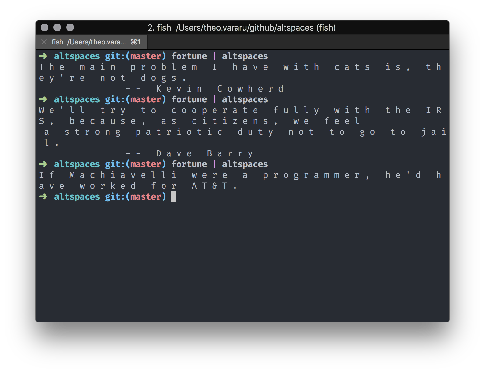

```
#   B a s e d   o n   [ a l t c a p s ] ( h t t p s : / / g i t h u b . c o m / b r i a n l o v e s w o r d s / a l t c a p s )   b y   [ b r i a n l o v e s w o r d s ] ( h t t p s : / / g i t h u b . c o m / b r i a n l o v e s w o r d s )

- - -

#   J u s t   ` n p m   i n s t a l l   - g   a l t s p a c e s `

# #   t h e n   ` e c h o   ' l o l   w h a t e v e r '   |   a l t s p a c e s   |   p b c o p y `

# # #   o r   ` a l t s p a c e s   <   y o u r - s t u p i d - f i l e . t x t   |   p b c o p y `

# # # #   a e s t h e t i c s

# # # # #   i t ' s   t h a t   s i m p l e .
```


